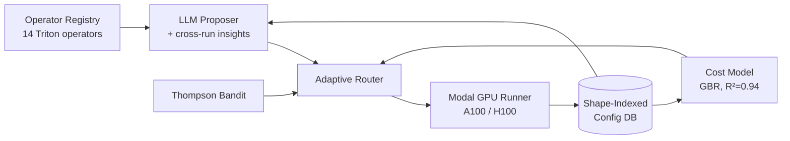
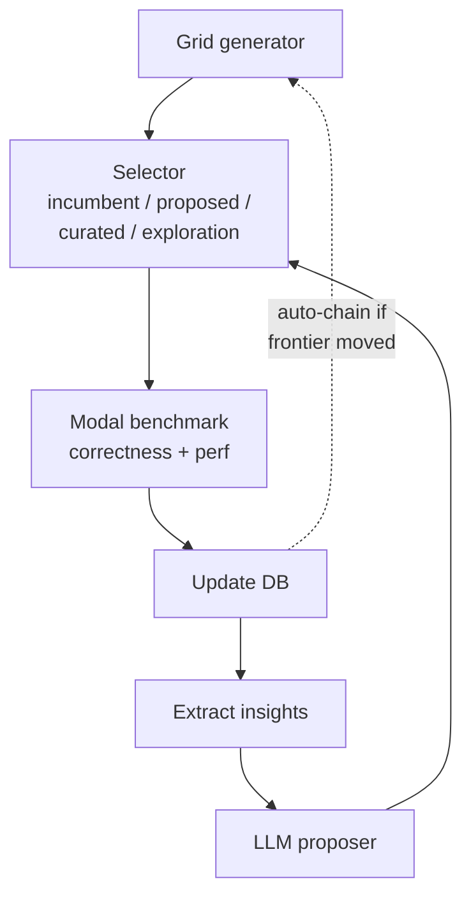

<p align="center">
  
</p>

# Noeris

> PwnKit Labs Research OS for autonomous empirical discovery.

Noeris is the Research OS inside PwnKit Labs: open-source adversarial reliability infrastructure for both humans and AI agents. Its current flagship track is autonomous GPU kernel optimization.

<p align="center">
  
  
  
  
</p>

## TL;DR

- **Validated on T4 (Colab), A100, and H100 (Modal) — 3 hardware targets.** All 14 operators pass correctness on all three GPUs.
- **Novel kernel: fused QK-RMSNorm + RoPE prologue for Gemma 3/4.** vLLM does not fuse this sequence (confirmed by source read at [`vllm/model_executor/models/gemma4.py:395-427`](https://github.com/vllm-project/vllm/pull/38826)). Our fused Triton kernel beats vLLM's 4-launch separated baseline by **10.2–12.9× on A100**, **10.4–11.9× on H100**, and **6.06× on T4** across all 6 Gemma 3/4 shape buckets. The **backward pass** kernel achieves **5.1–5.2× fusion speedup on T4** (GPU-validated), making the fused prologue usable for training — not just inference. No framework fuses the Gemma prologue backward. See [`docs/results/qk-norm-rope-fusion-speedup.md`](docs/results/qk-norm-rope-fusion-speedup.md).
- **14 parameterized Triton operators** covering the full Gemma 4 inference and training pipeline: matmul, rmsnorm (Gemma `1+w` affine), softmax (with softcap), layernorm, cross_entropy, attention (GQA + causal + sliding-window + QK-norm + YOCO KV-share), rotary (dual-base θ=10k/1M with p-RoPE), fused GeGLU, fused QK-RMSNorm+RoPE (forward), **fused QK-RMSNorm+RoPE backward** (4.9-7.5x on T4), MoE router (fused matmul+softmax+top-k), grouped GEMM (sort-free MoE expert dispatch), PLE gather (Gemma E2B/E4B per-layer embeddings), **paged-KV decode attention** (from-scratch Triton -- vLLM's is CUDA-only).
- **Full Gemma 4 architecture support**: grouped-query attention with `NUM_KV_HEADS` / `GROUP_SIZE` constexprs, asymmetric `head_dim=256/512` local/global layers, QK-norm with Gemma-mode `(1 + w)` affine, YOCO KV-cache sharing, MoE routing for 26B-A4B (128 experts, top-8), decode-time paged attention with page-table indirection + sliding-window page skipping — covers 31B Dense, 26B-A4B MoE, E2B, E4B, plus Llama 3 70B and Mistral GQA buckets. **110 shape buckets** across all operators, **606 unit tests**.
- **Learned feasibility**: shared-memory filter removed, bandit learns per-shape config feasibility from runtime failures. Zero hardcoded priors.
- **Learned GBR cost model**: R² = 0.94 on 516 training points; A100-trained rankings transfer to H100 with Spearman ρ = **0.967**.
- **Adaptive meta-bandit router** validated across 3 independent trials: matches the best fixed selector within 0.5%; naive alternating ensemble stalls.
- **Apples-to-apples KernelBench upstream comparison** with `cuda_event` + L2 flush timing matching the upstream harness. Real fp32 `nn.Module` problems, not synthetic shapes.
- **~$0.01 per iteration** on Modal. The full A100+H100 fusion_speedup table above was produced for under $0.20.

Paper draft (12,500+ words): [`docs/paper/noeris.md`](docs/paper/noeris.md).

## At a glance

- **Research OS, not a one-off benchmark script.** Shared ingestion, memory, execution, and verification substrate.
- **Flagship track: GPU kernels.** Parameterized Triton search with cross-run memory, learned selectors, and real hardware validation.
- **Systems story with evidence.** KernelBench-style reports, paper draft, hardware comparison tables, and stored artifacts.
- **Broader ceiling preserved.** The same substrate can support long-context, tool-use, evaluation, and future research tracks.

## Architecture



The proposer, selectors, database, and runner are all operator-agnostic. Adding a new operator is ~200 LoC plus a registry entry.

## What it does

Existing LLM-driven kernel systems rewrite free-form source and start fresh each run. Noeris instead generates kernels from small parameter tuples (e.g. `BLOCK_SIZE_M/N/K, num_warps, num_stages`) and persists winning configs in a JSON database keyed by `(operator, shape_bucket, hardware)`. Every CI run restores the previous database, adds new measurements, and saves it as a new artifact — knowledge compounds across sessions.

An LLM proposer sees the database state as "cross-run insights" and suggests novel configs; a gradient-boosted cost model and a Thompson-sampling bandit rank grid candidates before any GPU call; an adaptive meta-bandit router learns per-iteration which selector to trust.

## Iteration loop



## Results

### KernelBench — 53 problems, curated starter configs, no search

| GPU | fast_1.0 | fast_1.5 | fast_2.0 | fast_3.0 |
|---|---|---|---|---|
| A100-SXM4-40GB | **56.6%** | 41.5% | 37.7% | 32.1% |
| H100 | **56.6%** | 43.4% | 41.5% | 30.2% |

Full per-problem tables: [`docs/results/kernelbench-a100-53problems.md`](docs/results/kernelbench-a100-53problems.md), [`docs/results/kernelbench-h100-53problems.md`](docs/results/kernelbench-h100-53problems.md).

### Direct comparison to AutoKernel (H100)

| Kernel | Noeris | AutoKernel | Delta |
|---|---|---|---|
| RMSNorm | **11.66x** | 5.29x | +120% |
| Cross-entropy | **9.65x** | 2.94x | +228% |
| Softmax | **6.38x** | 3.44x | +85% |
| LayerNorm | 1.53x | 3.21x | -52% (gap to close) |

### Fused GeGLU for Gemma 2/3/4

| Problem | A100 GB/s | A100 vs eager | H100 GB/s | H100 vs eager |
|---|---|---|---|---|
| gemma2b FFN | 1167.6 | 3.77x | 1999.0 | 3.60x |
| gemma4b FFN | 1279.5 | 3.79x | 2120.3 | 3.61x |
| gemma26b FFN | 1351.1 | 3.98x | 2287.3 | 3.87x |
| gemma31b FFN | 1060.0 | 3.08x | 1601.3 | 2.65x |

All four problems use `bs4096_w16_s1`. Full reports: [`docs/results/kernelbench-geglu-a100.md`](docs/results/kernelbench-geglu-a100.md), [`docs/results/kernelbench-geglu-h100.md`](docs/results/kernelbench-geglu-h100.md).

### Sliding-window + fused QK-norm attention (newly landed)

The attention kernel now supports a `WINDOW_SIZE` constexpr that prunes the K-tile loop for Gemma 3/4 local attention (3 new shape buckets), and a fused QK-RMSNorm variant that normalizes Q once and K per-tile. Sliding-window validated on A100 with max error 0.00098; 22 new tests cover both features. Benchmark numbers on the two added KernelBench L3 problems are not yet collected.

### Selectors are complementary

Three-way ablation (baseline grid vs. cost model vs. Thompson bandit) across matmul, rmsnorm, softmax, cross_entropy, and attention shows the selectors win on different operators: bandit dominates matmul (+134% vs +45% cost model), cost model dominates attention (+66%) and wins softmax and cross_entropy by smaller margins.

An adaptive meta-bandit router learns per-iteration which selector to deploy. Across 3 independent trials on matmul A100:

| Condition | Mean TFLOPS | Std |
|---|---|---|
| Adaptive router | 132.19 | 6.89 |
| Thompson bandit | 132.81 | 6.93 |
| Cost model | ~85 | — |
| Naive alternating ensemble | 83.05 | 4.19 |

The adaptive router closes the gap to the best fixed selector within 0.5% without needing to know in advance which one to pick. See [`docs/results/adaptive-router-matmul-trial{1,2,3}.json`](docs/results/) and [`docs/results/three-way-summary.md`](docs/results/three-way-summary.md).

### Hardware cross-learning

A cost model trained on 516 A100 benchmark points and applied to H100 candidate ranking achieves Spearman ρ = **0.967** (`rmsnorm`, `softmax`, `layernorm`, `cross_entropy`, 16 configs each). See [`docs/results/hardware-cross-learning-a100-to-h100.json`](docs/results/hardware-cross-learning-a100-to-h100.json).

## Quick start

```bash
python3 -m venv .venv
. .venv/bin/activate
python -m pip install -e .

# KernelBench-style eval on an A100 via Modal
python -m research_engine.cli kernelbench-eval --gpu A100

# Search a specific operator with LLM proposals
python -m research_engine.cli triton-iterate \
    --operator rmsnorm --gpu A100 --llm --configs-per-run 8
```

Requires a Modal account (`pip install modal && modal token new`). Azure OpenAI or OpenAI credentials are optional but power the LLM proposer.

**Free GPU validation via Colab.** `scripts/colab_validate_all.py` validates all 14 operators on Google Colab's free T4 GPU — no Modal account or paid GPU needed.

## Repository layout

```
src/research_engine/
  triton_operators.py        operator protocol + registry
  triton_kernels.py          matmul kernel + ConfigDatabase
  triton_{rmsnorm,softmax,layernorm,cross_entropy}.py
  triton_attention.py        FlashAttention + causal + SWA + QK-norm
  triton_rotary.py           RoPE kernel
  triton_geglu.py            fused GeGLU for Gemma
  modal_runner.py            Modal GPU execution backend
  kernelbench.py             KernelBench-style evaluation + fast_p
  cost_model.py              gradient-boosted cost model
  ablation.py                cross-run learning + selector ablation
  cli.py                     CLI entry point
tests/                       80+ regression tests
docs/paper/noeris.md         paper draft (11,229 words)
docs/results/                all benchmark JSON + reports
```

## Related work

| System | Cross-run | Shape-indexed | Parameterized | Operators |
|---|---|---|---|---|
| **Noeris** | **Yes** | **Yes** | **Yes** | **14** |
| AutoKernel | No | No | No | 9 |
| KernelSkill (ICLR'26) | Skill retrieval | No | No | — |
| CUDA-L1 (ICLR'26) | Trained model | No | No | — |
| KernelFoundry | Within-run | No | Template-based | — |
| Triton autotune | Cached per shape | Per-shape | Fixed list | — |

## Citing

Paper draft: [`docs/paper/noeris.md`](docs/paper/noeris.md). MIT License. If you reference this work, please link to the repo.
